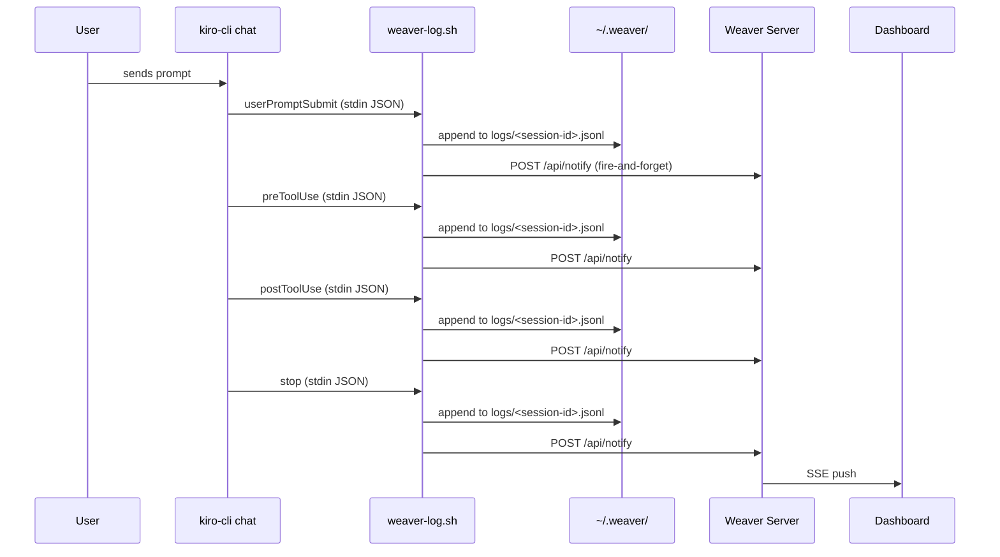
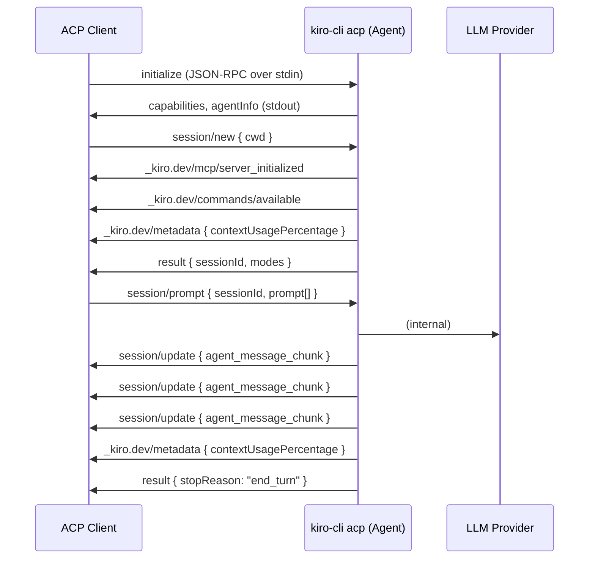
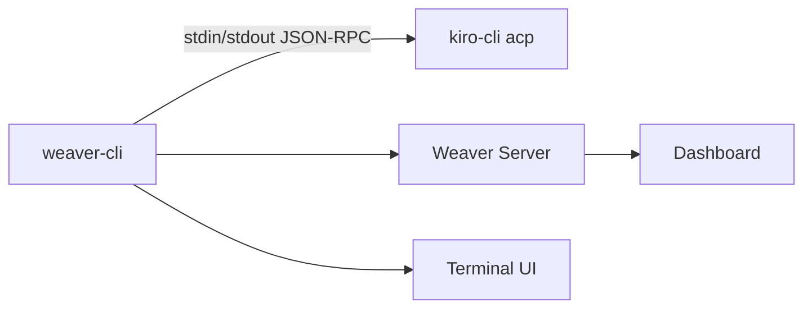

# Weaver ACP Exploration

Findings from exploring how Weaver could integrate with kiro-cli beyond the current hooks-based approach, including ACP (Agent Client Protocol) and direct SQLite access.

## Current Architecture

Weaver observes kiro-cli sessions using a hook script (`weaver-log.sh`) that kiro-cli invokes at trigger points during a conversation.



### What hooks capture

| Event | Data |
|-------|------|
| `agentSpawn` | Session start, cwd |
| `userPromptSubmit` | User's prompt text |
| `preToolUse` | Tool name, tool input |
| `postToolUse` | Tool name, tool input, tool response (truncated to 500 chars) |
| `stop` | Turn complete signal |

### What hooks do NOT capture

- Assistant message content (what the model actually said)
- Complete tool responses (truncated)
- Context window usage
- Token counts or cost data
- Tangent mode state
- Model ID per request

## Discovery: kiro-cli SQLite Database

kiro-cli stores full conversation state in a SQLite database:

```
~/Library/Application Support/kiro-cli/data.sqlite3
```

### Schema

```sql
CREATE TABLE conversations_v2 (
    key TEXT NOT NULL,              -- working directory (e.g. /Users/thompsnt/Documents/weaver)
    conversation_id TEXT NOT NULL,  -- UUID
    value TEXT NOT NULL,            -- full conversation JSON
    created_at INTEGER NOT NULL,    -- unix timestamp ms
    updated_at INTEGER NOT NULL,    -- unix timestamp ms
    PRIMARY KEY (key, conversation_id)
);
CREATE INDEX idx_conversations_v2_key_updated ON conversations_v2(key, updated_at DESC);
CREATE INDEX idx_conversations_v2_updated_at ON conversations_v2(updated_at DESC);
```

### Conversation JSON structure

The `value` column contains a JSON blob with these top-level keys:

```json
{
  "conversation_id": "uuid",
  "next_message": null,
  "history": [],
  "valid_history_range": [0, 21],
  "transcript": [],
  "tools": [],
  "context_manager": {},
  "context_message_length": 0,
  "latest_summary": null,
  "model_info": {},
  "file_line_tracker": {},
  "checkpoint_manager": {},
  "mcp_enabled": true,
  "user_turn_metadata": {},
  "tangent_state": null
}
```

Key fields:

- `history`: array of turns, each with `user` (Prompt/ToolUseResults) and `assistant` (Response/ToolUse) containing full content
- `transcript`: flat readable list of all messages (37 items for a medium conversation)
- `request_metadata` (per turn): `request_id`, `context_usage_percentage`, `model_id`, timing data
- `user_turn_metadata`: aggregated per-user-turn with credit costs and usage info
- `tangent_state`: only present when in tangent mode, contains `main_transcript`, `main_next_message`, `main_latest_summary`, and `tangent_start_time`

### Example: finding the most recent conversation

```sql
SELECT conversation_id, key, length(value), updated_at
FROM conversations_v2
ORDER BY updated_at DESC
LIMIT 5;
```

### Example: per-turn metadata

Each turn in `history` includes `request_metadata`:

```json
{
  "request_id": "f4c8c03b-98bf-4609-9f1f-6531749550c9",
  "context_usage_percentage": 1.5302,
  "message_id": "6ed4ef98-4260-4698-94c2-83a5350a6d03",
  "request_start_timestamp_ms": 1772654676289,
  "stream_end_timestamp_ms": 1772654690100,
  "model_id": "claude-opus-4.6-1m"
}
```

### Coupling concern

Reading the SQLite DB directly ties Weaver to kiro-cli's internal storage format. If they change the schema, Weaver breaks. This is the main motivation for exploring ACP as an alternative.

## Discovery: Agent Client Protocol (ACP)

ACP is an open protocol that standardizes communication between code editors/IDEs and coding agents. kiro-cli implements an ACP agent via `kiro-cli acp`.

Spec: https://agentclientprotocol.com/get-started/introduction

### How it works



### Verified ACP message flow

Tested successfully on 2026-03-04. Full round trip: initialize, create session, send prompt, receive streamed response.

#### 1. Initialize

```json
// Request
{
  "jsonrpc": "2.0",
  "id": 1,
  "method": "initialize",
  "params": {
    "clientInfo": { "name": "weaver-test", "version": "0.1.0" },
    "protocolVersion": "2025-01-01"
  }
}

// Response
{
  "jsonrpc": "2.0",
  "result": {
    "protocolVersion": 1,
    "agentCapabilities": {
      "loadSession": true,
      "promptCapabilities": { "image": true, "audio": false, "embeddedContext": false },
      "mcpCapabilities": { "http": false, "sse": false },
      "sessionCapabilities": {}
    },
    "agentInfo": { "name": "Kiro Agent", "title": "Kiro Agent", "version": "1.27.0" }
  },
  "id": 1
}
```

#### 2. Create session

`cwd` is required. `mcpServers` is optional.

```json
// Request
{
  "jsonrpc": "2.0",
  "id": 2,
  "method": "session/new",
  "params": {
    "cwd": "/Users/thompsnt/Documents/weaver",
    "mcpServers": []
  }
}

// Response (multiple messages)
// 1. MCP server init notification
{ "method": "_kiro.dev/mcp/server_initialized", "params": { "sessionId": "...", "serverName": "sequential-thinking" } }

// 2. Available commands
{ "method": "_kiro.dev/commands/available", "params": { "sessionId": "...", "commands": [...] } }

// 3. Context usage (kiro extension)
{ "method": "_kiro.dev/metadata", "params": { "sessionId": "...", "contextUsagePercentage": 0.5353 } }

// 4. Session created
{ "result": { "sessionId": "23d94b85-613c-451e-8619-71983a804215", "modes": { "currentModeId": "default", "availableModes": [...] } } }
```

#### 3. Send prompt

`prompt` is a `ContentBlock[]` array, not an object.

```json
// Request
{
  "jsonrpc": "2.0",
  "id": 3,
  "method": "session/prompt",
  "params": {
    "sessionId": "23d94b85-613c-451e-8619-71983a804215",
    "prompt": [
      { "type": "text", "text": "Say hello in exactly 5 words. Nothing else." }
    ]
  }
}

// Response: streamed agent_message_chunk notifications
{ "method": "session/update", "params": { "sessionId": "...", "update": { "sessionUpdate": "agent_message_chunk", "content": { "type": "text", "text": "Hello" } } } }
{ "method": "session/update", "params": { "sessionId": "...", "update": { "sessionUpdate": "agent_message_chunk", "content": { "type": "text", "text": "," } } } }
{ "method": "session/update", "params": { "sessionId": "...", "update": { "sessionUpdate": "agent_message_chunk", "content": { "type": "text", "text": " how" } } } }
{ "method": "session/update", "params": { "sessionId": "...", "update": { "sessionUpdate": "agent_message_chunk", "content": { "type": "text", "text": " are" } } } }
{ "method": "session/update", "params": { "sessionId": "...", "update": { "sessionUpdate": "agent_message_chunk", "content": { "type": "text", "text": " you today" } } } }
{ "method": "session/update", "params": { "sessionId": "...", "update": { "sessionUpdate": "agent_message_chunk", "content": { "type": "text", "text": "?" } } } }

// Context usage update (kiro extension)
{ "method": "_kiro.dev/metadata", "params": { "sessionId": "...", "contextUsagePercentage": 0.9265 } }

// Turn complete
{ "result": { "stopReason": "end_turn" }, "id": 3 }
```

### ACP session update types

| Update type | Description |
|-------------|-------------|
| `agent_message_chunk` | Streamed text from the model |
| `tool_call` | Tool invocation announced (pending) |
| `tool_call_update` | Tool progress/completion with content |
| `plan` | Agent's plan entries with priorities and status |
| `user_message_chunk` | User message replay (session/load only) |

### kiro-specific ACP extensions

These are custom notifications prefixed with `_kiro.dev/`:

| Method | Description |
|--------|-------------|
| `_kiro.dev/metadata` | Context usage percentage after each prompt |
| `_kiro.dev/commands/available` | Available slash commands |
| `_kiro.dev/commands/execute` | Execute a slash command |
| `_kiro.dev/commands/options` | Autocomplete options for a command |
| `_kiro.dev/mcp/server_initialized` | MCP server finished initializing |
| `_kiro.dev/mcp/oauth_request` | OAuth URL for MCP server auth |
| `_kiro.dev/compaction/status` | Context compaction progress |
| `_kiro.dev/clear/status` | Session clear status |

### ACP methods summary

| Method | Direction | Description |
|--------|-----------|-------------|
| `initialize` | client → agent | Handshake, exchange capabilities |
| `session/new` | client → agent | Create session (requires `cwd`) |
| `session/load` | client → agent | Load existing session by ID |
| `session/prompt` | client → agent | Send user prompt |
| `session/cancel` | client → agent | Cancel current operation |
| `session/set_mode` | client → agent | Switch agent mode |
| `session/set_model` | client → agent | Change model |
| `session/update` | agent → client | Streamed updates (notifications) |
| `session/request_permission` | agent → client | Tool approval request |

## Context Window Percentage

### How kiro calculates it

The model provider (Bedrock) returns token usage in every API response. kiro-cli computes:

```
contextUsagePercentage = (inputTokens / maxContextWindow) * 100
```

This cannot be replicated externally without access to the provider's tokenizer and knowledge of what kiro injects (system prompts, context, skills, etc.).

### How to access it

| Method | Available today | Coupling |
|--------|----------------|----------|
| SQLite DB (`context_usage_percentage` in request_metadata) | Yes | High: tied to kiro-cli internals |
| ACP `_kiro.dev/metadata` notification | Yes | Medium: kiro-specific extension |
| ACP standard `session/update` with `usage_update` | No (draft RFD) | Low: would be protocol-standard |

The ACP RFD for standardized usage tracking proposes:

```json
{
  "method": "session/update",
  "params": {
    "sessionId": "...",
    "update": {
      "sessionUpdate": "usage_update",
      "used": 53000,
      "size": 200000,
      "cost": { "amount": 0.045, "currency": "USD" }
    }
  }
}
```

Status: draft at https://agentclientprotocol.com/rfds/session-usage

## Architecture Options

### Option 1: Hooks + SQLite (enriched current approach)

Keep hooks for real-time activity signals. On each hook notification, also query the SQLite DB for full conversation content.

```
kiro-cli chat → hooks → weaver-log.sh → JSONL + notify server
                                              ↓
                                    server reads SQLite DB
                                              ↓
                                    dashboard (full content)
```

Pros:
- Minimal changes to current architecture
- Get assistant messages, complete tool outputs, tangent state, context usage
- No new infrastructure

Cons:
- Coupled to kiro-cli's SQLite schema
- Can't swap to a different agent
- Two data sources to reconcile

### Option 2: Weaver as ACP client (Path B)

Weaver replaces `kiro-cli chat` as the terminal experience. Spawns `kiro-cli acp` and drives the conversation.



Pros:
- Agent-agnostic: swap `kiro-cli acp` for any ACP-compliant agent
- Full conversation data through the protocol
- No hooks, no JSONL, no SQLite coupling
- Clean separation of concerns

Cons:
- Must build a terminal chat UI (input, markdown rendering, tool approval)
- Users switch from kiro's TUI to Weaver's TUI
- More complex initial implementation

### Option 3: ACP proxy (Path A)

Weaver sits between the kiro TUI and the agent, copying all traffic.

```
kiro TUI ←→ weaver-proxy ←→ kiro-cli acp
                  ↓
            weaver dashboard
```

Not viable today: `kiro-cli chat` bundles the client and agent together. There's no way to insert a proxy between them without a separate TUI client.

### Option 4: Headless ACP logger (Path C, dismissed)

Run a headless ACP client that just logs sessions. Dismissed because it provides no benefit over hooks: you'd spawn a whole agent process just to observe it, when hooks already observe the real one for free.

## Operational Notes

### Process cleanup

When spawning `kiro-cli acp` as a child process, the ACP process can survive if the parent exits without proper cleanup. During testing, two orphaned processes were found with PPID 1:

```
thompsnt  48797  1  /Users/thompsnt/.local/bin/kiro-cli-chat acp
thompsnt  41282  1  /Users/thompsnt/.local/bin/kiro-cli-chat acp
```

Note: the actual binary is `kiro-cli-chat` (not `kiro-cli`), with `acp` as an argument. Any process management code needs to account for this.

Mitigation: use process groups, signal handlers, and ensure `SIGTERM`/`SIGINT` propagate to the child process on parent exit.

### Session/new gotcha

`session/new` requires `cwd` as a mandatory field. Omitting it produces a stderr error but no JSON-RPC error response, which can look like the process froze:

```
error: Connection error: Parse error: {
  "error": "missing field `cwd`",
  "json": {},
  "phase": "deserialization"
}
```

## Recommendation

For the immediate term, Option 1 (hooks + SQLite reads) gives the most value with the least effort. It fills the gaps in hook data (assistant messages, context usage, tangent state) without changing the user experience.

For the long term, Option 2 (Weaver as ACP client) is the right direction if agent-agnosticism is a priority. The terminal UI is the main investment, but the protocol layer is straightforward: JSON-RPC over stdio with well-documented message types.

The two approaches are not mutually exclusive. Hooks can continue serving existing users while an ACP-based `weaver-cli` is developed incrementally.
